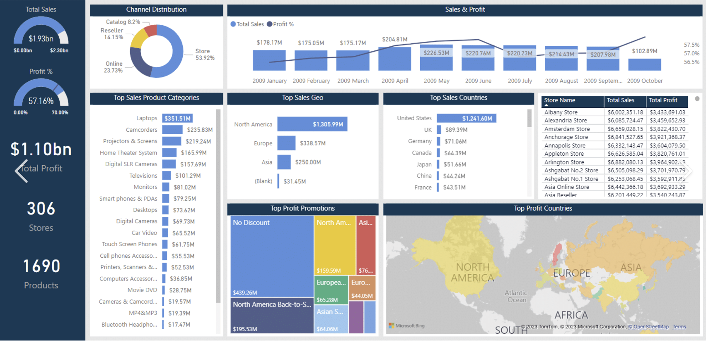

# Financial-Analysis-Product-Sales-Storewise

# Financial Analysis Dashboard - Product Sales Store-Wise

## The Brief
A retail company wanted to analyze product sales performance across various stores to optimize inventory management, pricing strategies, and overall store performance. The goal was to develop a dashboard that visualizes key metrics such as total sales, profit margins, sales trends, and product performance by store. The company had large datasets of product sales, revenue, and store information but lacked an efficient tool to derive actionable insights.

## Task
As a data analyst, I was tasked with creating an interactive Power BI dashboard that enables the company to track product sales across stores, analyze sales trends, and evaluate profitability at the store level. The dashboard needed to provide actionable insights that help store managers and decision-makers assess product performance, identify high-performing products, and optimize store-specific strategies.

## What I Learned
- The data provided included multiple CSV files with details on product sales, revenue, store locations, product categories, and sales dates.
- Data cleaning and transformation were required to handle missing data, ensure accurate sales figures, and calculate key financial metrics like profit margins and sales growth.
- Built a relational data model by linking sales data with store and product details, enabling dynamic filtering for deeper analysis.
- Designed an interactive Power BI dashboard to visualize key metrics, including total sales, profit margins, and store performance over time.
- Created custom visuals such as **bar charts** to compare sales across stores, **line charts** to visualize sales trends over time, and **heat maps** to identify high-performing product categories in each store.
- Implemented drill-through functionality to provide detailed insights into individual store performance and product-level sales data.
- Added dynamic slicers to filter data by product category, store location, time period, and sales range, allowing users to customize the dashboard view based on their needs.

## Dashboard Screenshot
Here is a screenshot of the **Financial Analysis Dashboard - Product Sales Store-Wise**:
##Overall Analysis

